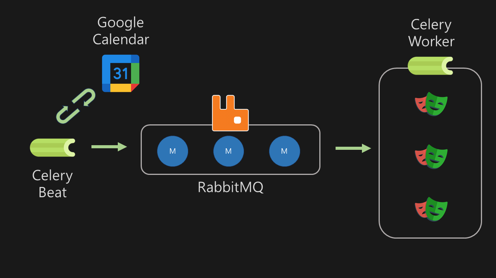

# Webinar 자동 시청 프로젝트

## 개발 동기

이 프로젝트는 새벽에(=AM 02:00 🤣) 하는 해외 웹비나를 도저히 참여 할 수 없어 만들었습니다.

<br/>

## 프로젝트 개요

정해진 시간에 특정 웹비나(isc2)를 자동으로 시청하게 해주는 애플리케이션 입니다. 구글 캘린더에 등록한 웹비나를 매일 확인하여 일정에 맞게 해당 웹비나에 자동으로 참석 합니다.

구현에 사용한 주요 라이브러리는 아래와 같습니다.

- Celery
- Google Calender API
- RabbitMQ
- Playwright

<br/>

## 설치

- Python 3.12
- playwright 설치 필요
- 의존성 관리는 Poetry를 사용
- Celery Beat & Worker daemon 등록

```sh
sudo playwright install-deps

playwright install
```

```sh
poetry install

celery -A run beat --loglevel=info --logfile=./logs/celery_beat.log

celery -A run worker -Q webinars --loglevel=info --logfile=./logs/celery_worker.log
```

### /etc/systemd/system/celery_beat.service

```sh
[Unit]
Description=Celery Beat
After=network.target
Requires=celery_worker.service

[Service]
User=ubuntu
Group=ubuntu
WorkingDirectory=/home/ubuntu/rabbit-celery
ExecStart=/home/ubuntu/rabbit-celery/.venv/bin/celery -A run beat --loglevel=info --logfile=./logs/celery_beat.log
Restart=always

[Install]
WantedBy=multi-user.target
```

### /etc/systemd/system/celery_worker.service

```sh
[Unit]
Description=Celery Worker
After=network.target

[Service]
User=ubuntu
Group=ubuntu
WorkingDirectory=/home/ubuntu/rabbit-celery
ExecStart=/home/ubuntu/rabbit-celery/.venv/bin/celery -A run worker -Q webinars --loglevel=info --logfile=./logs/celery_worker.log
Restart=always

[Install]
WantedBy=multi-user.target
```

```sh
sudo systemctl daemon-reload

sudo systemctl start celery_beat.service
sudo systemctl start celery_worker.service
```

<br/>

## 세부 동작



### Publisher : Celery Beat

- Celery Beat: 스케줄러. 매일 00:00 시 정각에 특정 동작을 수행
- Google calendar API : Google Calendar 에서 등록되어 있는 일정 중에서 특정 webinar 정보를 가져옴

### Broker : RabbitMQ

- RabbitMQ: 브로커로 사용

### Worker : Celery

- Celery Worker: 비동기 작업 큐를 처리
- playwright : chromium 을 통해 webinar 시청

## Error : RabbitMQ Timeout

```text
[2024-06-12 08:40:59,524: CRITICAL/MainProcess] Unrecoverable error: PreconditionFailed(406, 'PRECONDITION_FAILED - delivery acknowledgement on channel 1 timed out. Timeout value used: 1800000 ms. This timeout value can be configured, see consumers doc guide to learn more', (0, 0), '')
```

- 0시에 작업을 스케줄링 해놓고 약 23시간 후에 실행되는 웹비니가 존재
- 큐에서 task를 제대로 가져왔지만
- RabbitMQ 에서 `delivery acknowledgement on channel 1 timed out` 에러 처리
- task가 실패
- [참고](https://docs.celeryq.dev/en/stable/userguide/calling.html#calling-eta)

## 원인 : consumer_timeout

- RabbitMQ 에서 `consumer_timeout` 라는 설정이 존재
- RabbitMQ에서 메시지를 수신한 소비자가 지정된 시간 내에 메시지를 확인하지 않으면 해당 채널이 닫힘
- 기본 값은 `1800000 ms` = 30분
- 메시지가 큐로 반환되는 시간 제한을 지정
- 이 타임아웃 값은 밀리초 단위로 설정
- [tick 간격이 최소 60000 ms = 1분 이기 때문에 1분 이상의 시간을 설정해야 한다.](https://stackoverflow.com/questions/70957962/rabbitmq-consumer-timeout-behavior-not-working-as-expected)

## 해결 : consumer_timeout 늘리기

- 자정마다 가져 beat 스케줄 작업을 매 시간마다 동작하게 변경
- rabbitmq.conf 파일 생성
- 10800000 = 3시간으로 설정
- docker-compose.yml 에 추가

```python
# task 함수 주기 설정
app.conf.beat_schedule = {
    "add-every-seconds": {
        "task": "app.tasks.beat.schedule_today_webinars",
        "schedule": crontab(minute=0),  # 매 시간마다
    },
}
```

```ini
# 3 hours
consumer_timeout = 10800000
```

```yml
    volumes:
      - ./config/rabbitmq.conf:/etc/rabbitmq/rabbitmq.conf
```
